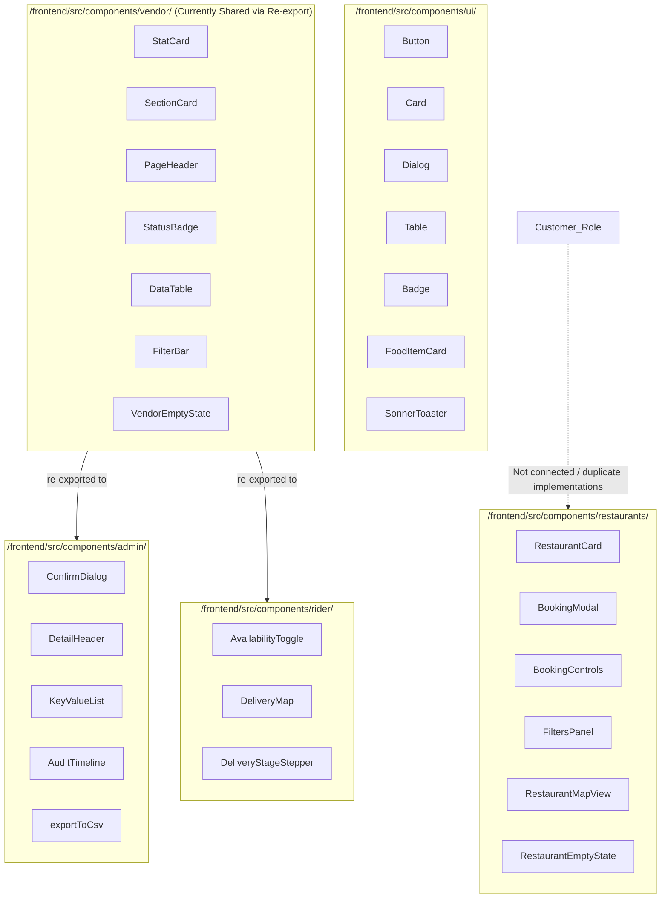

# Consistency, Cohesion & Friction-Reduction Audit — mvfds

**Document Version:** 1.0.0  
**Repository Root:** `/home/usign/.temp/mvfds`  
**Date:** October 8, 2026  
**Auditor:** Antigravity AI Assistant  
**Scope:** Frontend (`/home/usign/.temp/mvfds/frontend`) & Backend (`/home/usign/.temp/mvfds/backend`)

---

## Executive Summary

The Multi-Vendor Food Delivery System (`mvfds`) is an extensive, feature-complete platform encompassing 28 Mongoose models, 25 backend controllers, over 80 API routes, 16 frontend service modules, and 60+ user interfaces spanning 5 primary roles (Unregistered / Public, Customer, Vendor, Rider, Admin).

While core business capabilities—including authentication, vendor/rider onboarding, menu and category cataloguing, multi-vendor cart persistence, order state machines, table reservations, unified payment gateways, and live GPS tracking—are implemented, the codebase exhibits critical **structural inconsistencies**, **interaction friction**, and **architectural fragmentation**:
1. **Absence of Role Guards in Layouts:** `/home/usign/.temp/mvfds/frontend/src/App.tsx` mounts role shells (`VendorLayout`, `RiderLayout`, `AdminLayout`) without layout-level route protection or authentication redirects. An unauthenticated guest can navigate directly to `/admin`, `/vendor`, or `/rider` URLs and render the dashboard shells.
2. **Interactive Card Conflicts & Pseudo-Links:** Clickable cards (`RestaurantCard`, `FoodItemCard`, `VendorRestaurantsPage` cards, `PopularRestaurants` cards) frequently employ clickable `<motion.div>` or `<motion.article>` elements with `onClick={() => navigate(...)}` instead of semantic router links. Within these clickable containers sit nested action buttons (Favorite, Add to Cart, Edit, Delete, Map view, Quantity steppers), causing touch conflicts, middle-click failure, accessibility loss, and keyboard navigation hazards.
3. **Component Duplication & Misplacement:** Common SaaS dashboard primitives (`StatCard`, `SectionCard`, `PageHeader`, `StatusBadge`, `DataTable`, `FilterBar`) were authored inside `/home/usign/.temp/mvfds/frontend/src/components/vendor/` and are re-exported by Rider and Admin, while Customer and Public pages use disparate, inline implementations.
4. **Dead Interactions & Under-Construction Placeholders:** Public restaurant cards and restaurant browsing headers feature disabled "Book a table" buttons displaying "Table booking is under construction" tooltips, despite the complete end-to-end multi-vendor reservation engine already existing in `/home/usign/.temp/mvfds/frontend/src/components/restaurants/BookingModal.tsx` and `/home/usign/.temp/mvfds/frontend/src/pages/customer/ReservationsPage.tsx`. Similarly, `TrendingFoodItems` renders food cards with no clickable or actionable handlers.
5. **Format & Badge Fragmentation:** Status badges, order lifecycle labels, currency formatting, and date formatting are repeatedly re-declared across dozens of pages using conflicting color tokens, custom spans, and local helper functions.

---

## 1. Architecture Map

### 1.1 Routes by Role

Mounted in `/home/usign/.temp/mvfds/frontend/src/App.tsx`:

#### A. Public & Guest Routes (Mounted under `RootLayout` -> `MainLayout`)
- `/` — `/home/usign/.temp/mvfds/frontend/src/pages/public/NewHomePage.tsx`
- `/about` — `/home/usign/.temp/mvfds/frontend/src/pages/public/AboutPage.tsx`
- `/careers` — `/home/usign/.temp/mvfds/frontend/src/pages/public/CareersPage.tsx`
- `/privacy` — `/home/usign/.temp/mvfds/frontend/src/pages/public/PrivacyPolicyPage.tsx`
- `/terms` — `/home/usign/.temp/mvfds/frontend/src/pages/public/TermsPage.tsx`
- `/refund` — `/home/usign/.temp/mvfds/frontend/src/pages/public/RefundPolicyPage.tsx`
- `/contact` — `/home/usign/.temp/mvfds/frontend/src/pages/public/ContactPage.tsx`
- `/faq` & `/help` — `/home/usign/.temp/mvfds/frontend/src/pages/public/FAQPage.tsx`
- `/restaurants` — `/home/usign/.temp/mvfds/frontend/src/pages/public/RestaurantsPage.tsx`
- `/restaurants/:id` — `/home/usign/.temp/mvfds/frontend/src/pages/public/RestaurantDetailsPage.tsx`
- `/categories` — `/home/usign/.temp/mvfds/frontend/src/pages/public/CategoriesPage.tsx`
- `/menu/:restaurantId/:itemId` — `/home/usign/.temp/mvfds/frontend/src/pages/public/MenuItemDetailPage.tsx`

#### B. Auth Routes (Mounted under `RootLayout` -> `AuthLayout`)
- `/login` — `/home/usign/.temp/mvfds/frontend/src/pages/auth/LoginPage.tsx`
- `/register` — `/home/usign/.temp/mvfds/frontend/src/pages/auth/RegisterPage.tsx`
- `/vendor/register` — `/home/usign/.temp/mvfds/frontend/src/pages/auth/VendorRegisterPage.tsx`
- `/rider/register` — `/home/usign/.temp/mvfds/frontend/src/pages/auth/RiderRegisterPage.tsx`
- `/forgot-password` — `/home/usign/.temp/mvfds/frontend/src/pages/auth/ForgotPassword.tsx`
- `/reset-password` — `/home/usign/.temp/mvfds/frontend/src/pages/auth/ResetPassword.tsx`
- `/verify-email` — `/home/usign/.temp/mvfds/frontend/src/pages/auth/VerifyEmail.tsx`
- `/auth/google/callback` — `/home/usign/.temp/mvfds/frontend/src/pages/auth/GoogleAuthCallbackPage.tsx`

#### C. Customer Routes (Mounted under `RootLayout` -> `MainLayout`)
- `/profile` — `/home/usign/.temp/mvfds/frontend/src/pages/customer/ProfilePage.tsx`
- `/favorites` — `/home/usign/.temp/mvfds/frontend/src/pages/customer/FavoritesPage.tsx`
- `/cart` — `/home/usign/.temp/mvfds/frontend/src/pages/customer/CartPage.tsx`
- `/checkout` — `/home/usign/.temp/mvfds/frontend/src/pages/customer/CheckoutPage.tsx`
- `/orders` — `/home/usign/.temp/mvfds/frontend/src/pages/customer/OrdersPage.tsx`
- `/orders/:id` — `/home/usign/.temp/mvfds/frontend/src/pages/customer/OrderDetailsPage.tsx`
- `/reservations` — `/home/usign/.temp/mvfds/frontend/src/pages/customer/ReservationsPage.tsx`
- `/reservations/:id` — `/home/usign/.temp/mvfds/frontend/src/pages/customer/ReservationDetailsPage.tsx`
- `/notifications` — `/home/usign/.temp/mvfds/frontend/src/pages/customer/NotificationsPage.tsx`
- `/support` — `/home/usign/.temp/mvfds/frontend/src/pages/customer/SupportPage.tsx`
- `/support/new` — `/home/usign/.temp/mvfds/frontend/src/pages/customer/CreateTicketPage.tsx`
- `/support/:id` — `/home/usign/.temp/mvfds/frontend/src/pages/customer/TicketDetailPage.tsx`
- `/onboarding` — `/home/usign/.temp/mvfds/frontend/src/pages/customer/OnboardingPage.tsx` (Direct child of `RootLayout`)

#### D. Vendor Routes (Mounted under `VendorLayout`)
- `/vendor` — `/home/usign/.temp/mvfds/frontend/src/pages/vendor/VendorDashboardPage.tsx`
- `/vendor/restaurants` — `/home/usign/.temp/mvfds/frontend/src/pages/vendor/VendorRestaurantsPage.tsx`
- `/vendor/restaurants/new` — `/home/usign/.temp/mvfds/frontend/src/pages/vendor/RestaurantFormPage.tsx`
- `/vendor/restaurants/:id/edit` — `/home/usign/.temp/mvfds/frontend/src/pages/vendor/RestaurantFormPage.tsx`
- `/vendor/menu` — `/home/usign/.temp/mvfds/frontend/src/pages/vendor/VendorMenuPage.tsx`
- `/vendor/menu/items/new` — `/home/usign/.temp/mvfds/frontend/src/pages/vendor/MenuItemEditorPage.tsx`
- `/vendor/menu/items/:itemId/edit` — `/home/usign/.temp/mvfds/frontend/src/pages/vendor/MenuItemEditorPage.tsx`
- `/vendor/orders` — `/home/usign/.temp/mvfds/frontend/src/pages/vendor/VendorOrdersPage.tsx`
- `/vendor/orders/:id` — `/home/usign/.temp/mvfds/frontend/src/pages/vendor/VendorOrderDetailPage.tsx`
- `/vendor/reservations` — `/home/usign/.temp/mvfds/frontend/src/pages/vendor/VendorReservationsPage.tsx`
- `/vendor/reservations/settings` — `/home/usign/.temp/mvfds/frontend/src/pages/vendor/VendorReservationSettingsPage.tsx`
- `/vendor/restaurants/:id/reservations/settings` — `/home/usign/.temp/mvfds/frontend/src/pages/vendor/VendorReservationSettingsPage.tsx`
- `/vendor/reviews` — `/home/usign/.temp/mvfds/frontend/src/pages/vendor/VendorReviewsPage.tsx`
- `/vendor/promotions` — `/home/usign/.temp/mvfds/frontend/src/pages/vendor/VendorPromotionsPage.tsx`
- `/vendor/analytics` — `/home/usign/.temp/mvfds/frontend/src/pages/vendor/VendorAnalyticsPage.tsx`
- `/vendor/earnings` — `/home/usign/.temp/mvfds/frontend/src/pages/vendor/VendorEarningsPage.tsx`
- `/vendor/customers` — `/home/usign/.temp/mvfds/frontend/src/pages/vendor/VendorCustomersPage.tsx`
- `/vendor/settings` — `/home/usign/.temp/mvfds/frontend/src/pages/vendor/VendorSettingsPage.tsx`
- `/vendor/support` — `/home/usign/.temp/mvfds/frontend/src/pages/vendor/VendorSupportPage.tsx`
- `/vendor/support/new` — `/home/usign/.temp/mvfds/frontend/src/pages/vendor/VendorCreateTicketPage.tsx`
- `/vendor/support/:id` — `/home/usign/.temp/mvfds/frontend/src/pages/vendor/VendorTicketDetailPage.tsx`
- `/vendor/onboarding` — `/home/usign/.temp/mvfds/frontend/src/pages/vendor/VendorOnboardingPage.tsx` (Direct child of root)

#### E. Rider Routes (Mounted under `RiderLayout`)
- `/rider` — `/home/usign/.temp/mvfds/frontend/src/pages/rider/RiderDashboardPage.tsx`
- `/rider/available` — `/home/usign/.temp/mvfds/frontend/src/pages/rider/AvailableDeliveriesPage.tsx`
- `/rider/active` — `/home/usign/.temp/mvfds/frontend/src/pages/rider/ActiveDeliveryPage.tsx`
- `/rider/earnings` — `/home/usign/.temp/mvfds/frontend/src/pages/rider/RiderEarningsPage.tsx`
- `/rider/history` — `/home/usign/.temp/mvfds/frontend/src/pages/rider/RiderHistoryPage.tsx`
- `/rider/profile` — `/home/usign/.temp/mvfds/frontend/src/pages/rider/RiderProfilePage.tsx`
- `/rider/support` — `/home/usign/.temp/mvfds/frontend/src/pages/rider/RiderSupportPage.tsx`
- `/rider/support/new` — `/home/usign/.temp/mvfds/frontend/src/pages/rider/RiderCreateTicketPage.tsx`
- `/rider/support/:id` — `/home/usign/.temp/mvfds/frontend/src/pages/rider/RiderTicketDetailPage.tsx`
- `/rider/onboarding` — `/home/usign/.temp/mvfds/frontend/src/pages/rider/RiderOnboardingPage.tsx` (Direct child of root)

#### F. Admin Routes (Mounted under `AdminLayout`)
- `/admin` — `/home/usign/.temp/mvfds/frontend/src/pages/admin/Dashboard.tsx`
- `/admin/users/customers` — `/home/usign/.temp/mvfds/frontend/src/pages/admin/users/CustomersPage.tsx`
- `/admin/users/customers/:id` — `/home/usign/.temp/mvfds/frontend/src/pages/admin/users/CustomerDetailPage.tsx`
- `/admin/users/vendors` — `/home/usign/.temp/mvfds/frontend/src/pages/admin/users/VendorsPage.tsx`
- `/admin/users/vendors/:id` — `/home/usign/.temp/mvfds/frontend/src/pages/admin/users/VendorDetailPage.tsx`
- `/admin/users/drivers` — `/home/usign/.temp/mvfds/frontend/src/pages/admin/users/DriversPage.tsx`
- `/admin/users/drivers/:id` — `/home/usign/.temp/mvfds/frontend/src/pages/admin/users/DriverDetailPage.tsx`
- `/admin/restaurants` — `/home/usign/.temp/mvfds/frontend/src/pages/admin/restaurants/RestaurantsPage.tsx`
- `/admin/restaurants/approval-queue` — `/home/usign/.temp/mvfds/frontend/src/pages/admin/restaurants/ApprovalQueuePage.tsx`
- `/admin/restaurants/:id` — `/home/usign/.temp/mvfds/frontend/src/pages/admin/restaurants/RestaurantDetailPage.tsx`
- `/admin/orders` — `/home/usign/.temp/mvfds/frontend/src/pages/admin/orders/OrdersPage.tsx`
- `/admin/orders/live` — `/home/usign/.temp/mvfds/frontend/src/pages/admin/orders/FleetMapPage.tsx`
- `/admin/orders/:id` — `/home/usign/.temp/mvfds/frontend/src/pages/admin/orders/OrderDetailPage.tsx`
- `/admin/reservations` — `/home/usign/.temp/mvfds/frontend/src/pages/admin/reservations/AdminReservationsPage.tsx`
- `/admin/finance/payouts` — `/home/usign/.temp/mvfds/frontend/src/pages/admin/finance/PayoutsPage.tsx`
- `/admin/finance/revenue` — `/home/usign/.temp/mvfds/frontend/src/pages/admin/finance/RevenueReportsPage.tsx`
- `/admin/support` — `/home/usign/.temp/mvfds/frontend/src/pages/admin/support/SupportPage.tsx`
- `/admin/support/:id` — `/home/usign/.temp/mvfds/frontend/src/pages/admin/support/AdminTicketDetailPage.tsx`
- `/admin/disputes` — `/home/usign/.temp/mvfds/frontend/src/pages/admin/support/DisputePage.tsx`
- `/admin/reviews` — `/home/usign/.temp/mvfds/frontend/src/pages/admin/support/ReviewModerationPage.tsx`
- `/admin/content/taxonomy` — `/home/usign/.temp/mvfds/frontend/src/pages/admin/content/TaxonomyPage.tsx`
- `/admin/content/blocks` — `/home/usign/.temp/mvfds/frontend/src/pages/admin/content/ContentBlocksPage.tsx`
- `/admin/audit-log` — `/home/usign/.temp/mvfds/frontend/src/pages/admin/system/AuditLogPage.tsx`
- `/admin/team` — `/home/usign/.temp/mvfds/frontend/src/pages/admin/system/AdminTeamPage.tsx`
- `/admin/settings` — `/home/usign/.temp/mvfds/frontend/src/pages/admin/settings/PlatformSettingsPage.tsx`

---

### 1.2 Layouts by Role

| Layout | Path | Description | Role / Auth Protection |
|---|---|---|---|
| `RootLayout` | `/home/usign/.temp/mvfds/frontend/src/layouts/RootLayout.tsx` | Base container, `ScrollToTop`, accessibility skip-link, global gradient background. | None (Global root wrapper) |
| `MainLayout` | `/home/usign/.temp/mvfds/frontend/src/layouts/MainLayout.tsx` | Sticky `Navbar` (h-20), responsive main padding (`pt-20`), full `Footer`. | None. Public and customer pages share this layout without client-side auth checks. |
| `AuthLayout` | `/home/usign/.temp/mvfds/frontend/src/layouts/AuthLayout.tsx` | Split-screen shell. Left: scrollable form column. Right: route-aware marketing brand panel (`customer` \| `vendor` \| `rider`). | None. (Should redirect authenticated users to their post-auth destination). |
| `VendorLayout` | `/home/usign/.temp/mvfds/frontend/src/layouts/VendorLayout.tsx` | Desktop rail/sidebar + mobile drawer, restaurant selector, order audio/badge alert, user menu. | **MISSING:** Does not check `isAuthenticated` or `user.role === 'vendor'`. |
| `RiderLayout` | `/home/usign/.temp/mvfds/frontend/src/layouts/RiderLayout.tsx` | Mobile-first layout with desktop sidebar and mobile bottom navigation tab bar, online/offline switch. | **MISSING:** Does not check `isAuthenticated` or `user.role === 'driver'`. |
| `AdminLayout` | `/home/usign/.temp/mvfds/frontend/src/layouts/AdminLayout.tsx` | Collapsible sidebar, breadcrumb path generator, global `Cmd+K` entity search modal, admin tier pill. | **MISSING:** Does not check `isAuthenticated` or `user.role === 'admin'`. |

---

### 1.3 Shared vs. Role-Specific Component Distribution



- **Primitives currently trapped in `/home/usign/.temp/mvfds/frontend/src/components/vendor/`:**
  - `StatCard.tsx`, `SectionCard.tsx`, `PageHeader.tsx`, `StatusBadge.tsx`, `DataTable.tsx`, `FilterBar.tsx`, `VendorEmptyState.tsx`, `ChartCard.tsx`.
  - Admin and Rider re-export these from `@/components/vendor`. Customer pages do not have access and duplicate them with inline styles.
- **Primitives in `@/components/admin/`:**
  - `ConfirmDialog.tsx` (reason-prompting modal)
  - `DetailHeader.tsx` (entity title + action buttons)
  - `KeyValue.tsx` (definition list item)
  - `AuditTimeline.tsx`
  - `exportCsv.ts` (client CSV generation)
- **Primitives in `@/components/rider/`:**
  - `AvailabilityToggle.tsx`
  - `DeliveryMap.tsx` (Leaflet live rider/order map)
  - `DeliveryStageStepper.tsx` (stage progression component)

---

### 1.4 API Modules Layer

All services reside in `/home/usign/.temp/mvfds/frontend/src/services/` and use the centralized Axios client `/home/usign/.temp/mvfds/frontend/src/lib/httpClient.ts`:

1. `authService.ts`: Registration, login, Google OAuth, session check, email verification, password reset, change password, complete onboarding.
2. `userService.ts`: Customer profile (`/api/users/me`), addresses CRUD, photo/cover uploads, favorites, dietary preferences, saved payment methods.
3. `apiService.ts`: Public restaurant directory, featured restaurants, restaurant detail by ID.
4. `menuService.ts`: Restaurant menu listing, single menu item details.
5. `homeService.ts`: Explore endpoints (top categories, trending items, popular restaurants, category menu items).
6. `orderService.ts`: Order creation, customer order history, order tracking, order cancellation, reordering.
7. `cartService.ts`: Server-side cart management (get cart, add item, update quantity, remove item, merge guest cart, checkout from cart).
8. `reviewService.ts`: Post restaurant review, retrieve customer reviews, delete review.
9. `reservationService.ts`: Table bookings (check availability, create reservation, get user reservations, get vendor reservations, cancel reservation, update reservation status, update reservation settings).
10. `riderService.ts`: Rider profile, toggle availability, available deliveries, active delivery, update delivery status, complete delivery, earnings & history.
11. `vendorService.ts`: Vendor profile, restaurant CRUD, category CRUD, menu item CRUD, toggle availability, vendor orders, order status updates, coupon management, reviews reply, earnings & analytics.
12. `adminService.ts`: Overview statistics, user management (customer/vendor/driver suspend/ban/verify/tiers), restaurant approval queue, order management, revenue reports, payout management, support ticket resolution, review moderation, taxonomy management, CMS blocks, platform settings, audit log.
13. `supportService.ts`: Support ticket creation, ticket details, threaded reply messages across all roles.
14. `notificationService.ts`: Notifications listing, unread count badge, mark as read, mark all read.
15. `orderChatService.ts`: In-order chat messaging between customer, vendor, and rider.
16. `paymentService.ts`: Payment gateway initiation, simulation of card/mobile wallet, OTP verification, withdrawal request submissions.

---

### 1.5 Socket.io Events & Flow

**Server:** `/home/usign/.temp/mvfds/backend/src/socket.ts`  
**Client:** `/home/usign/.temp/mvfds/frontend/src/contexts/SocketContext.tsx` & `/home/usign/.temp/mvfds/frontend/src/hooks/useSocket.ts`

| Event Name | Direction | Emitter | Listener | Payload / Description |
|---|---|---|---|---|
| `connection` | Handshake | Client | Server | Authenticates via token in cookie/query/header; joins user to `user:<id>`, `vendor:<id>`, `driver:<id>`, or `admin:room`. |
| `newOrder` | Outbound | Backend Controller | Vendor (`SocketContext`) | `{ orderId, orderNumber, total, itemsCount, restaurantId }`. Plays notification chime, increments badge, triggers toast. |
| `orderStatusUpdate` | Outbound | Backend Controller | Customer (`SocketContext`, `OrdersPage`, `OrderDetailsPage`) | `{ orderId, orderNumber, newStatus, previousStatus, updatedAt }`. Updates order status real-time on customer screens. |
| `driver:newDeliveryAvailable` | Outbound | Backend Controller | Rider (`SocketContext`, `AvailableDeliveriesPage`) | Emitted when order transitions to `ready` or restaurant confirms order. Prompts nearby available riders. |
| `driver:locationUpdate` | Bi-directional | Rider -> Server -> Customer | Rider (`useDriverLocationBroadcast`), Server, Customer (`LiveTrackingPanel`) | `{ orderId, driverId, location: { latitude, longitude, heading, speed } }`. Persisted in MongoDB time-series `DriverLocationEvent` and relayed to `user:<customerId>`. |
| `joinOrderRoom` | Inbound | Customer | Server | Customer joins room `order:<orderId>` to track real-time delivery telemetry. |
| `driver:joinOrderRoom` | Inbound | Rider | Server | Rider joins room `order:<orderId>` to broadcast active delivery coordinates. |
| `notification:new` | Outbound | Notification Service | Client (`NotificationContext`) | `{ notification: Notification }`. Increments unread badge and displays toast. |
| `chat:message` | Bi-directional | Client <-> Server | Customer / Vendor / Rider (`OrderChat`) | `{ orderId, senderId, senderRole, message, timestamp }`. Relayed to participants in order room. |

---

## 2. Pattern Inventory

| UI / Logic Concern | Distinct Implementations Found | File Paths | Inconsistency / Conflict Identified |
|---|---|---|---|
| **Buttons** | 1. Shadcn `Button` (`variant="default\|brand\|destructive\|outline\|secondary\|ghost\|link"`)<br>2. Ad-hoc gradient buttons with raw Tailwind (`bg-gradient-to-r from-brand-500 to-red-500 ...`)<br>3. Plain unstyled `<button>` or `<motion.button>` elements<br>4. Custom `IconBtn` helper components | - `/home/usign/.temp/mvfds/frontend/src/components/ui/button.tsx`<br>- `/home/usign/.temp/mvfds/frontend/src/components/Navbar.tsx`<br>- `/home/usign/.temp/mvfds/frontend/src/components/ReviewsAndRatings.tsx`<br>- `/home/usign/.temp/mvfds/frontend/src/pages/admin/restaurants/RestaurantsPage.tsx:426`<br>- `/home/usign/.temp/mvfds/frontend/src/pages/admin/support/ReviewModerationPage.tsx:325` | `Button` lacks a native `loading` / `isLoading` prop. Pages manually wire `<Loader2 className="animate-spin" />` or omit loading states completely, enabling double-submits. Raw buttons in public components duplicate the `brand` variant with inconsistent shadows and hover effects. |
| **Cards** | 1. Shadcn `Card`, `CardHeader`, `CardTitle`, `CardContent`<br>2. `SectionCard` (Vendor/Admin/Rider)<br>3. `StatCard` (Metric summary card)<br>4. Custom `<motion.div>` / `<motion.article>` cards (`RestaurantCard`, `FoodItemCard`, `OptionCard`) | - `/home/usign/.temp/mvfds/frontend/src/components/ui/card.tsx`<br>- `/home/usign/.temp/mvfds/frontend/src/components/vendor/SectionCard.tsx`<br>- `/home/usign/.temp/mvfds/frontend/src/components/vendor/StatCard.tsx`<br>- `/home/usign/.temp/mvfds/frontend/src/components/restaurants/RestaurantCard.tsx`<br>- `/home/usign/.temp/mvfds/frontend/src/components/ui/FoodItemCard.tsx` | Customer pages use standard `Card`, Vendor/Admin/Rider use `SectionCard` and `StatCard`. Border radius, padding scales, and elevation differ between Customer (`rounded-xl` / `rounded-2xl` with default shadow) and Admin/Vendor (`rounded-xl border border-border bg-card shadow-sm`). |
| **Forms & Validation** | 1. React Hook Form + Zod (`Form`, `FormField`, `FormItem`, `FormLabel`, `FormControl`, `FormMessage`)<br>2. Native unmanaged inputs with manual `useState`<br>3. FormDialog with controlled state | - `/home/usign/.temp/mvfds/frontend/src/components/ui/form.tsx`<br>- `/home/usign/.temp/mvfds/frontend/src/pages/auth/RegisterPage.tsx`<br>- `/home/usign/.temp/mvfds/frontend/src/pages/vendor/RestaurantFormPage.tsx`<br>- `/home/usign/.temp/mvfds/frontend/src/pages/admin/settings/PlatformSettingsPage.tsx`<br>- `/home/usign/.temp/mvfds/frontend/src/lib/validation.ts`<br>- `/home/usign/.temp/mvfds/frontend/src/lib/vendorValidation.ts` | Two divergent validation schema libraries exist (`validation.ts` vs `vendorValidation.ts`). `validation.ts` arbitrarily restricts email registration to 16 hardcoded domains, while backend and `vendorValidation.ts` allow valid RFC domains. Some forms display inline errors under fields; others only trigger Sonner toasts upon server rejection. |
| **Tables / Lists** | 1. Shadcn primitive `Table`, `TableHeader`, `TableRow`, `TableCell`<br>2. Custom `DataTable` with column definitions, sorting, pagination, skeleton loader<br>3. Raw HTML `<table>` elements with manual map loops<br>4. Div-based flex/grid lists | - `/home/usign/.temp/mvfds/frontend/src/components/ui/table.tsx`<br>- `/home/usign/.temp/mvfds/frontend/src/components/vendor/DataTable.tsx`<br>- `/home/usign/.temp/mvfds/frontend/src/pages/admin/reservations/AdminReservationsPage.tsx`<br>- `/home/usign/.temp/mvfds/frontend/src/pages/customer/OrdersPage.tsx` | `DataTable` is used extensively in Vendor, Admin, and Rider, but `AdminReservationsPage.tsx` reverted to writing an unstyled raw HTML `<table>`. Customer `OrdersPage` renders cards in a vertical stack with separate pagination buttons. |
| **Modals / Dialogs** | 1. Shadcn `Dialog`, `DialogContent`, `DialogHeader`<br>2. Hook-based `useConfirm()` (`ConfirmContext`)<br>3. Component-based `ConfirmDialog` (`components/admin/ConfirmDialog.tsx`)<br>4. Custom full-feature modals (`BookingModal`, `UnifiedPaymentModal`, `AddressDialog`, `PhoneVerificationDialog`) | - `/home/usign/.temp/mvfds/frontend/src/components/ui/dialog.tsx`<br>- `/home/usign/.temp/mvfds/frontend/src/contexts/ConfirmContext.tsx`<br>- `/home/usign/.temp/mvfds/frontend/src/components/admin/ConfirmDialog.tsx`<br>- `/home/usign/.temp/mvfds/frontend/src/components/restaurants/BookingModal.tsx`<br>- `/home/usign/.temp/mvfds/frontend/src/components/payment/UnifiedPaymentModal.tsx` | Two competing confirmation patterns: `useConfirm()` (promise-based, simple confirmation) and `<ConfirmDialog>` (declarative component supporting reason inputs and audit logging). Role logout actions and deletes use different confirmation dialogs. |
| **Toasts / Alerts** | 1. Unified Sonner wrapper `toast` (`@/lib/toast`)<br>2. Direct Sonner imports in isolated files | - `/home/usign/.temp/mvfds/frontend/src/lib/toast.ts`<br>- `/home/usign/.temp/mvfds/frontend/src/components/ui/sonner.tsx` | Toasts are largely unified via `/home/usign/.temp/mvfds/frontend/src/lib/toast.ts`, but call signatures fluctuate between single string (`toast.error("Message")`) and object parameter (`toast.error("Error", { description: "Message" })`). |
| **Loading / Empty / Error States** | 1. `PageLoader` (full-screen spinner)<br>2. `VendorEmptyState` (re-exported as `EmptyState` in Admin & Rider)<br>3. `RestaurantEmptyState` (`components/restaurants/EmptyState.tsx`)<br>4. Inline empty states with raw Lucide icons & text<br>5. `RestaurantCardSkeleton` & `ProfileSkeleton`<br>6. `ErrorBoundary` (class component) | - `/home/usign/.temp/mvfds/frontend/src/components/PageLoader.tsx`<br>- `/home/usign/.temp/mvfds/frontend/src/components/vendor/VendorEmptyState.tsx`<br>- `/home/usign/.temp/mvfds/frontend/src/components/restaurants/EmptyState.tsx`<br>- `/home/usign/.temp/mvfds/frontend/src/pages/customer/OrdersPage.tsx:173`<br>- `/home/usign/.temp/mvfds/frontend/src/pages/customer/FavoritesPage.tsx`<br>- `/home/usign/.temp/mvfds/frontend/src/components/ErrorBoundary.tsx` | Customer empty states display large gray icons inside cards; Vendor/Admin/Rider empty states use rounded icon badges inside dashed borders. Multiple custom skeleton components exist instead of composing the shared `Skeleton` primitive. |
| **Status Badges** | 1. Shadcn `Badge` (`variant="default\|secondary\|outline\|orange"`)<br>2. Token-driven `StatusBadge` with registry & tones<br>3. Raw inline `<span>` elements with hardcoded Tailwind colors (`STATUS_COLORS`)<br>4. Helper functions (`getStatusBadge(status)`) | - `/home/usign/.temp/mvfds/frontend/src/components/ui/badge.tsx`<br>- `/home/usign/.temp/mvfds/frontend/src/components/vendor/StatusBadge.tsx`<br>- `/home/usign/.temp/mvfds/frontend/src/pages/customer/OrdersPage.tsx:22`<br>- `/home/usign/.temp/mvfds/frontend/src/pages/customer/SupportPage.tsx:67`<br>- `/home/usign/.temp/mvfds/frontend/src/pages/customer/ReservationsPage.tsx:25`<br>- `/home/usign/.temp/mvfds/frontend/src/pages/admin/reservations/AdminReservationsPage.tsx:33` | Extreme fragmentation: `StatusBadge` in Vendor handles orders, payouts, and vendor approvals. Customer `OrdersPage` ignores `StatusBadge` and hardcodes `STATUS_COLORS` with different tones. Reservation statuses (`pending`, `confirmed`, `cancelled`, `completed`) have custom switch statements re-implemented in three separate files. |
| **Filters / Search** | 1. `FilterBar` (Vendor/Admin)<br>2. `FiltersPanel` (Public restaurants)<br>3. Inline search inputs with clear button<br>4. Tab-based filters (`CategoryTab`, `SegmentedTabs`) | - `/home/usign/.temp/mvfds/frontend/src/components/vendor/FilterBar.tsx`<br>- `/home/usign/.temp/mvfds/frontend/src/components/restaurants/FiltersPanel.tsx`<br>- `/home/usign/.temp/mvfds/frontend/src/pages/customer/OrdersPage.tsx:152`<br>- `/home/usign/.temp/mvfds/frontend/src/components/TopFoodCategories.tsx:69` | Public restaurants filter uses a full sidebar panel; Admin uses horizontal `FilterBar`; Customer pages use wrapping button rows with inconsistent active styling. |
| **Pagination** | 1. Integrated pagination inside `DataTable`<br>2. Manual Prev/Next buttons with page counter<br>3. Infinite scroll sentinel (`IntersectionObserver`) with fallback button | - `/home/usign/.temp/mvfds/frontend/src/components/vendor/DataTable.tsx`<br>- `/home/usign/.temp/mvfds/frontend/src/pages/customer/OrdersPage.tsx:250`<br>- `/home/usign/.temp/mvfds/frontend/src/pages/public/RestaurantsPage.tsx:1038` | No shared standalone `Pagination` component. Lists outside `DataTable` (e.g. `OrdersPage`) repeat custom button markup. |
| **Price / Date Formatting** | 1. Centralized formatters in `@/utils/format`<br>2. Local `formatTaka` functions (`৳${Math.round(amount)}`)<br>3. Local `formatDeliveryTime` functions<br>4. Inline `Intl.DateTimeFormat` or `new Date().toLocaleDateString()` | - `/home/usign/.temp/mvfds/frontend/src/utils/format.ts`<br>- `/home/usign/.temp/mvfds/frontend/src/pages/public/MenuItemDetailPage.tsx:58`<br>- `/home/usign/.temp/mvfds/frontend/src/pages/public/RestaurantDetailsPage.tsx:119,130`<br>- `/home/usign/.temp/mvfds/frontend/src/pages/customer/OrdersPage.tsx:124`<br>- `/home/usign/.temp/mvfds/frontend/src/pages/rider/AvailableDeliveriesPage.tsx:20` | Centralized formatters in `/home/usign/.temp/mvfds/frontend/src/utils/format.ts` are bypassed by multiple public and customer pages in favor of duplicated helper functions. Currency formatting varies between `৳${n}`, `৳${n.toFixed(2)}`, and rounded `৳${Math.round(n)}`. |
| **Role Redirects & Routing** | 1. Centralized `getPostAuthPath` & `useRedirectIfAuthenticated`<br>2. Hardcoded inline `navigate('/')` or `navigate('/dashboard')`<br>3. Role-based layout redirect (missing) | - `/home/usign/.temp/mvfds/frontend/src/hooks/useAuthRedirect.ts`<br>- `/home/usign/.temp/mvfds/frontend/src/pages/auth/LoginPage.tsx`<br>- `/home/usign/.temp/mvfds/frontend/src/pages/auth/GoogleAuthCallbackPage.tsx` | While `useAuthRedirect.ts` defines `getPostAuthPath()`, individual page handlers occasionally duplicate role branching. More critically, there is no route-guard wrapper preventing unauthorized access to protected role layouts. |
| **Data Fetching Approach** | 1. `useEffect` + `useCallback` + local loading/error state<br>2. Custom `useApi` hook (underutilized)<br>3. Optimistic cart updates with background sync | - `/home/usign/.temp/mvfds/frontend/src/hooks/useApi.ts`<br>- `/home/usign/.temp/mvfds/frontend/src/contexts/CartContext.tsx`<br>- All route-level page components | Almost all pages implement boilerplate `const [loading, setLoading] = useState(true)` and `useEffect`. `useApi` exists in `/home/usign/.temp/mvfds/frontend/src/hooks/useApi.ts` but is rarely used. |
| **Error Handling** | 1. `try...catch` with `toast.error(message)`<br>2. Inline error messages with retry buttons<br>3. Silent error catching (`catch { /* ignore */ }`)<br>4. Unhandled service response error branches | - `/home/usign/.temp/mvfds/frontend/src/pages/customer/OrdersPage.tsx:78`<br>- `/home/usign/.temp/mvfds/frontend/src/pages/public/RestaurantsPage.tsx:968`<br>- `/home/usign/.temp/mvfds/frontend/src/layouts/RiderLayout.tsx:102` | API error payload normalization is uneven: some catch blocks inspect `err.response?.data?.message`, others assume service methods return `{ success: false, message }`, and others swallow errors silently. |
| **Route Guards** | 1. None in `App.tsx`<br>2. Page-level manual redirection in selected pages | - `/home/usign/.temp/mvfds/frontend/src/App.tsx`<br>- `/home/usign/.temp/mvfds/frontend/src/layouts/VendorLayout.tsx`<br>- `/home/usign/.temp/mvfds/frontend/src/layouts/RiderLayout.tsx`<br>- `/home/usign/.temp/mvfds/frontend/src/layouts/AdminLayout.tsx` | **CRITICAL ARCHITECTURAL GAP:** No `ProtectedRoute` or `RoleGuard` component protects `/vendor/*`, `/rider/*`, `/admin/*`, or customer account paths like `/profile`, `/orders`, `/checkout`. Unauthenticated users can load layout shells. |

---

## 3. Interactive-Card Audit

Every clickable card, row, and tile in the codebase was inspected for nested interactive conflicts:

| File Path | Component | Parent Role / Action | Child Interactive Elements | Conflict / Broken Behavior | Fix Strategy |
|---|---|---|---|---|---|
| `/home/usign/.temp/mvfds/frontend/src/components/restaurants/RestaurantCard.tsx` | `RestaurantCard` | `<motion.article onClick={onCardClick} onKeyDown={onKeyDown} tabIndex={0} role="article">` (Navigates to restaurant detail) | 1. `<button onClick={handleImageClick}>`<br>2. `<motion.button onClick={handleFavoriteClick}>`<br>3. `<Button disabled>Book a table</Button>`<br>4. `<Button onClick={handleViewMapClick}>` | **CRITICAL CONFLICT:** Nested `<button>` tags inside a clickable `role="article"` with keyboard listener. Tab focus lands on card, then image button, then favorite, then map. Pressing Enter/Space triggers card navigation regardless of child focus. "Book a table" is hardcoded disabled with "under construction" tooltip. | Convert card to `InteractiveCard` standard: Use semantic `<Link to="...">` on restaurant title with stretched-link CSS overlay (`::after`). Place Favorite, Map, and Booking buttons on `relative z-10`. Wire `onBookClick` to open `BookingModal`. |
| `/home/usign/.temp/mvfds/frontend/src/components/ui/FoodItemCard.tsx` | `FoodItemCard` (`grid` & `list` variants) | `<motion.div onClick={onClick} className="... cursor-pointer">` (Navigates to food detail) | 1. `<QtyControls>` (`<button>` Minus, `<button>` Plus)<br>2. `<motion.button onClick={onAddToCart}>` | **MAJOR CONFLICT:** Parent is a non-semantic `<div>` with `onClick`. Middle-click / Cmd-click ("Open in new tab") fails. While buttons have `e.stopPropagation()`, the card lacks keyboard accessibility (`tabIndex`, `role="link"`). | Apply stretched-link pattern: wrap title in semantic `<Link to="...">`, ensure buttons sit at `z-10` with isolated stop-propagation handlers. Add keyboard focus rings. |
| `/home/usign/.temp/mvfds/frontend/src/components/ui/FoodItemCard.tsx` | `FoodItemCard` (`vendor` variant) | Card container `<motion.div>` | 1. `<button onClick={onEdit}>`<br>2. `<button onClick={onDelete}>`<br>3. `<VendorStatusDropdown>` (`<button>` toggle + dropdown list) | **MINOR ISSUE:** Hover actions (`opacity-0 group-hover:opacity-100`) are invisible on touch/mobile screens, preventing mobile vendors from editing or deleting items. | Make action buttons permanently visible or accessible via responsive overflow trigger on small viewports. |
| `/home/usign/.temp/mvfds/frontend/src/components/PopularRestaurants.tsx` | `RestaurantCard` | Outer `<motion.div className="group relative ...">` | 1. Hover-revealed `<Link to="...">View Menu</Link>` | **MAJOR FRICTION:** Entire 460px card is inert to clicks. Only the small hover-revealed "View Menu" link navigates. On mobile devices, card cannot be tapped naturally. | Make entire card navigate to `/restaurants/:id` using stretched link or clickable card container, with immediate mobile responsiveness. |
| `/home/usign/.temp/mvfds/frontend/src/components/TrendingFoodItems.tsx` | `TrendingFoodItems` | 3D draggable card `<motion.div drag="x">` | Renders `<FoodItemCard variant="highlight">` without `onClick` or `onAddToCart` | **BLOCKER / DEAD UI:** Card displays culinary items but neither clicking the card nor clicking any button does anything. The items cannot be ordered or inspected. | Pass `onClick={() => navigate(...)` and `onAddToCart` callback into `FoodItemCard`. |
| `/home/usign/.temp/mvfds/frontend/src/pages/vendor/VendorRestaurantsPage.tsx` | Restaurant Card | `<motion.div role="button" tabIndex={0} onClick={navigateEdit} onKeyDown={...}>` | 1. `<Button onClick={navigateEdit} title="Edit">`<br>2. `<Button onClick={handleDelete} title="Delete">` | **MAJOR CONFLICT:** Card simulates button via `role="button"`. Hover action buttons use `e.stopPropagation()`, but are completely hidden on mobile viewports (`opacity-0 group-hover:opacity-100`), preventing mobile vendors from deleting restaurants. | Make card a semantic card with card title link; surface actions with persistent or mobile-accessible buttons. |
| `/home/usign/.temp/mvfds/frontend/src/pages/customer/CartPage.tsx` | Empty state & cart action links | `<Link to="...">` wrapping `<Button>` | `<Button className="...">Browse Restaurants</Button>` nested inside `<Link>` | **SYNTAX / DOM BUG:** `<button>` inside `<a>` is invalid HTML and violates accessibility standards. | Replace with `<Button asChild><Link to="...">...</Link></Button>`. |
| `/home/usign/.temp/mvfds/frontend/src/components/Navbar.tsx` | Header Register Button | `<Link to="/register">` | `<Button className="...">Sign Up</Button>` | **SYNTAX / DOM BUG:** `<button>` nested inside `<a>`. | Replace with `<Button asChild><Link to="/register">Sign Up</Link></Button>`. |
| `/home/usign/.temp/mvfds/frontend/src/components/ReviewsAndRatings.tsx` | Footer CTA | `<Link to="/restaurants">` | `<Button className="...">Order Now</Button>` | **SYNTAX / DOM BUG:** `<button>` nested inside `<a>`. | Replace with `<Button asChild><Link to="/restaurants">Order Now</Link></Button>`. |
| `/home/usign/.temp/mvfds/frontend/src/pages/auth/VerifyEmail.tsx` | Action Button | `<Link to="/register">` | `<Button variant="outline">Back to Register</Button>` | **SYNTAX / DOM BUG:** `<button>` nested inside `<a>`. | Replace with `<Button asChild><Link to="/register">Back to Register</Link></Button>`. |
| `/home/usign/.temp/mvfds/frontend/src/pages/customer/OrdersPage.tsx` | Order Card | `<Link to={'/orders/${order._id}'}>` wrapping `<Card>` | Nested card container inside router link | Not broken (no nested buttons), but card lacks keyboard focus indicator. | Add visible focus ring to the Link wrapper. |
| `/home/usign/.temp/mvfds/frontend/src/components/vendor/DataTable.tsx` | `DataTable` | `<TableRow onClick={onRowClick}>` | Action column cells with `<IconBtn>` or dropdown menus | **POTENTIAL CONFLICT:** Clicking an action button inside a table row can trigger `onRowClick` if the developer forgets `e.stopPropagation()`. | Wrap row action cells in a dedicated container that automatically captures and stops event propagation. |
| `/home/usign/.temp/mvfds/frontend/src/pages/admin/restaurants/ApprovalQueuePage.tsx` | Application Card | `<SectionCard>` container | 1. `<Checkbox onCheckedChange={...}>`<br>2. `<Link to={'/admin/restaurants/${item._id}'}>{item.name}</Link>`<br>3. `<Button onClick={handleReject}>`<br>4. `<Button onClick={handleApprove}>` | Currently safe (card itself is not clickable, only title is link), but card body is inert. | Retain isolated action buttons at `z-10`; allow card body to navigate via stretched link if desired. |
| `/home/usign/.temp/mvfds/frontend/src/pages/rider/AvailableDeliveriesPage.tsx` | Delivery Request Card | Outer `<motion.div>` container | `<Button onClick={handleAccept}>Accept delivery</Button>` | No conflicting parent link. Accept button has spinner and disabled state. | Clean. Ensure keyboard focus order remains intuitive. |

---

## 4. Friction & Bug Log

| ID | File Path | Role | Severity | Description | Proposed Fix |
|---|---|---|---|---|---|
| **F-01** | `/home/usign/.temp/mvfds/frontend/src/App.tsx` | All Roles | **Blocker** | **Missing Route Guards:** Protected routes (`/admin/*`, `/vendor/*`, `/rider/*`, `/profile`, `/orders`, `/checkout`) have no auth or role guards in `App.tsx` or layout files. Any unauthenticated visitor can enter URLs directly and render private layouts. | Implement unified `<ProtectedRoute>` / `<RoleGuard>` wrapper verifying `isAuthenticated` and checking `user.role` against required roles. Redirect unauthorized users via `getPostAuthPath()`. |
| **F-02** | `/home/usign/.temp/mvfds/frontend/src/components/restaurants/RestaurantCard.tsx`<br>`/home/usign/.temp/mvfds/frontend/src/pages/public/RestaurantsPage.tsx` | Customer / Guest | **Major** | **Dead Table Booking Feature:** "Book a table" buttons in `RestaurantCard` and `RestaurantsPage` header are hardcoded with `disabled` and tooltip "Table booking is under construction", despite complete reservation backend & frontend modal existing. | Wire "Book a table" button to invoke `onBookClick(restaurant)`, opening `BookingModal`. Enable table booking filter toggle in `RestaurantsPage`. |
| **F-03** | `/home/usign/.temp/mvfds/frontend/src/components/TrendingFoodItems.tsx` | Guest / Customer | **Major** | **Dead UI on Homepage Carousel:** `TrendingFoodItems` renders culinary masterpiece cards with no `onClick` navigation and no `onAddToCart` button wired, making the cards inert. | Wire item clicks to `/menu/:restaurantId/:itemId` and provide an active "Order" action button. |
| **F-04** | `/home/usign/.temp/mvfds/frontend/src/components/Navbar.tsx`<br>`/home/usign/.temp/mvfds/frontend/src/pages/customer/CartPage.tsx`<br>`/home/usign/.temp/mvfds/frontend/src/pages/customer/ProfilePage.tsx` | All | **Major** | **Invalid Nested Interactive Elements:** Multiple instances of `<Link to="..."><Button ...>...</Button></Link>` generating `<button>` elements nested inside `<a>` tags. | Refactor all instances to use `<Button asChild><Link to="...">...</Link></Button>`. |
| **F-05** | `/home/usign/.temp/mvfds/frontend/src/pages/vendor/VendorRestaurantsPage.tsx` | Vendor | **Major** | **Mobile Accessibility Failure:** Edit and Delete buttons on vendor restaurant cards are styled with `opacity-0 group-hover:opacity-100`, making them completely unreachable on touchscreens and mobile viewports. | Remove hover-only opacity; display buttons persistently or provide an accessible action menu. |
| **F-06** | `/home/usign/.temp/mvfds/frontend/src/components/ui/button.tsx` | All | **Major** | **Missing Loading State on Buttons:** Shared `Button` primitive lacks `loading` or `isLoading` prop. Action buttons throughout the application lack spinner feedback and disabled state during async mutations, permitting duplicate clicks (order placement, payouts, status transitions). | Add `loading?: boolean` to `ButtonProps`. When `true`, automatically set `disabled={true}`, disable pointer events, and inject `<Loader2 className="animate-spin mr-2" />`. |
| **F-07** | `/home/usign/.temp/mvfds/frontend/src/lib/validation.ts` | Customer / Guest | **Major** | **Artificial Email Provider Limitation:** `emailSchema` in `validation.ts` restricts customer registration to 16 hardcoded email domains (rejecting university, company, and custom domain emails). Backend validation does not impose this restriction. | Remove artificial domain restriction; align with standard RFC email validation matching the backend Zod schema. |
| **F-08** | `/home/usign/.temp/mvfds/frontend/src/components/vendor/StatusBadge.tsx`<br>`/home/usign/.temp/mvfds/frontend/src/pages/customer/OrdersPage.tsx`<br>`/home/usign/.temp/mvfds/frontend/src/pages/customer/ReservationsPage.tsx` | All | **Major** | **Fragmented Status Badges:** Multiple conflicting badge implementations. Vendor/Admin uses `StatusBadge`, Customer `OrdersPage` uses inline spans with `STATUS_COLORS`, Reservations uses local switch functions. | Move `StatusBadge` to `@/components/ui/StatusBadge.tsx`. Expand registry to include all order, reservation, ticket, payout, and rider statuses. Migrate all roles to use it. |
| **F-09** | `/home/usign/.temp/mvfds/frontend/src/utils/format.ts`<br>`/home/usign/.temp/mvfds/frontend/src/pages/public/MenuItemDetailPage.tsx`<br>`/home/usign/.temp/mvfds/frontend/src/pages/public/RestaurantDetailsPage.tsx` | Public / Customer | **Minor** | **Fragmented Currency & Date Formatting:** Multiple pages declare local `formatTaka`, `formatDeliveryTime`, and date parsing helpers instead of reusing `@/utils/format`. Currency symbol and precision vary (`৳120` vs `৳120.00`). | Standardize all currency formatting through `formatCurrency()` and delivery times through `formatDeliveryTime()`. |
| **F-10** | `/home/usign/.temp/mvfds/frontend/src/components/vendor/VendorEmptyState.tsx`<br>`/home/usign/.temp/mvfds/frontend/src/components/restaurants/EmptyState.tsx`<br>`/home/usign/.temp/mvfds/frontend/src/pages/customer/OrdersPage.tsx` | All | **Minor** | **Inconsistent Empty & Error States:** Vendor/Admin/Rider uses `VendorEmptyState` (dashed border with badge icon); Customer pages use inline cards with large unbadged icons; Public uses `RestaurantEmptyState`. | Unify into a single, role-agnostic `EmptyState` and `ErrorState` primitive in `@/components/ui/`. |
| **F-11** | `/home/usign/.temp/mvfds/frontend/src/pages/admin/reservations/AdminReservationsPage.tsx` | Admin | **Minor** | **Table Incohesion:** Admin reservations page renders an unstyled, raw HTML `<table>` while every other admin page uses the cohesive `DataTable` component. | Migrate `AdminReservationsPage` to use `DataTable` with column definitions and sorting. |

---

## 5. Spec Conformance Matrix (25 User Stories)

Evaluated against the 25 project user stories and acceptance criteria from `PROJECT_PROPOSAL` §3 & §4:

| Story ID | Role | Description & Acceptance Criteria | Status | Notes & Evidence |
|---|---|---|---|---|
| **US-1** | Unregistered | View homepage with featured restaurants without login. | ✅ Implemented | Public route `/` renders `NewHomePage.tsx`, composing `PopularRestaurants`, `TopFoodCategories`, `TrendingFoodItems`. Public endpoints `/api/restaurants/featured` and `/api/explore/*` require no authentication. |
| **US-2** | Customer | Register with email & password (hashed with bcrypt, min 8 chars, unique email). | ✅ Implemented | `RegisterPage.tsx` uses RHF + Zod schema. Backend `User.ts` enforces bcrypt pre-save hashing and unique email constraint. |
| **US-3** | Customer | Secure login with JWT token & session persistence. | ✅ Implemented | `LoginPage.tsx` authenticates against `POST /api/auth/login`. Returns JWT access and refresh tokens, sets HttpOnly cookies, and restores session via `GET /api/auth/session`. |
| **US-4** | Admin | Admin logs in and accesses administrative dashboard. | ✅ Implemented | Admin credentials verified at `/login`, role verified via `authorize(UserRole.ADMIN)`. `Dashboard.tsx` loads system KPIs, charts, and pending actions from `/api/admin/dashboard/*`. |
| **US-5** | Vendor | Vendor registers restaurant account, subject to admin approval. | ✅ Implemented | `VendorRegisterPage.tsx` registers vendor identity. Restaurant creation via `POST /api/vendor/restaurants` initializes `approvalStatus: "pending"`. |
| **US-6** | Admin | Admin approves or rejects pending vendor registrations. | ✅ Implemented | `ApprovalQueuePage.tsx` allows single and bulk approval/rejection via `POST /api/admin/restaurants/:id/approve` and `POST /api/admin/restaurants/:id/reject`. |
| **US-7** | Vendor | Manage restaurant profile (name, address, operating hours, photos). | ✅ Implemented | `RestaurantFormPage.tsx` supports operating hours per weekday, logo and cover photo uploads, contact info, and cuisine tags. |
| **US-8** | Vendor | Add and manage menu items (name, description, price, category, photo). | ✅ Implemented | `MenuItemEditorPage.tsx` and `VendorMenuPage.tsx` handle item creation, variants, addons, dietary tags, preparation time, and availability toggles. |
| **US-9** | Admin | Admin manages food categories taxonomy. | ⚠️ Partial | `TaxonomyPage.tsx` provides CRUD for cuisine types and tags. **Gap:** The spec requirement "Cannot delete category if restaurants are using it" lacks strict referential integrity check in `admin.content.controller.ts` because restaurants store `cuisineType: [String]` as free-form strings. |
| **US-10** | Customer | Browse restaurants by category and location. | ✅ Implemented | `RestaurantsPage.tsx` provides category filters, cuisine selection, location/district filters, and 2dsphere geospatial filtering via Leaflet map view. |
| **US-11** | Customer | Search and filter food items by name, category, and price. | ✅ Implemented | `CategoriesPage.tsx` and `RestaurantsPage.tsx` filter by query string, price range, and dietary tags. |
| **US-12** | Customer | Multi-vendor cart with vendor-wise item separation. | ⚠️ Partial | `CartContext.tsx` and `CartPage.tsx` group items by restaurant visually and calculate per-restaurant lines. **Gap:** Backend `Cart.ts` schema stores `restaurantId` as a single `ObjectId` per cart document rather than an array of vendor baskets. |
| **US-13** | Customer | Place order with delivery address and payment method. | ✅ Implemented | `CheckoutPage.tsx` validates delivery address, payment method (COD, Card, Mobile Wallet), calculates tax/fees, and submits order via `orderService.createOrder`. |
| **US-14** | Vendor | Vendor receives incoming orders in real time. | ✅ Implemented | `VendorOrdersPage.tsx` and `VendorDashboardPage.tsx` subscribe to `newOrder` socket event, increment badge count, play audio beep, and render toast notification. |
| **US-15** | Vendor | Update order status (`received` → `preparing` → `ready for pickup`). | ✅ Implemented | `VendorOrderDetailPage.tsx` updates status via `PATCH /api/vendor/orders/:id/status`. Order state machine logs history with actor and timestamp; emits `orderStatusUpdate` over Socket.io. |
| **US-16** | Rider | Rider registers with vehicle details and license documents. | ✅ Implemented | `RiderRegisterPage.tsx` collects license number, vehicle type, and document photos; sets `DriverProfile.applicationStatus: "pending"`. |
| **US-17** | Admin | Admin approves or rejects rider registration applications. | ✅ Implemented | `DriversPage.tsx` and `DriverDetailPage.tsx` review applications, approve via `POST /api/admin/users/drivers/:id/approve` and record `approvedBy` / `approvedAt`. |
| **US-18** | Rider | Rider views available delivery requests with distance & earnings. | ✅ Implemented | `AvailableDeliveriesPage.tsx` fetches available ready orders, calculates trip distance via Haversine formula, displays earnings breakdown, and provides atomic order acceptance. |
| **US-19** | Rider | Rider updates delivery status (`picked up` → `on the way` → `delivered`). | ✅ Implemented | `ActiveDeliveryPage.tsx` steps through delivery progression, records cash collected for COD, captures photo proof of delivery, and updates status. |
| **US-20** | Customer | Customer tracks order status and delivery in real time. | ✅ Implemented | `OrderDetailsPage.tsx` renders live stage progress, subscribes to `orderStatusUpdate`, and tracks live driver GPS coordinates on Leaflet map via `driver:locationUpdate`. |
| **US-21** | Customer | Rate and review restaurant and food items after delivery. | ⚠️ Partial | `OrderDetailsPage.tsx` and `reviewService` submit 1-5 star ratings with reviews (enforcing one review per order). **Gap:** Reviews are linked to `restaurantId` only; item-level rating for individual `MenuItem` entities is not modeled in `Review.ts`. |
| **US-22** | Customer | Rate rider based on delivery service. | ✅ Implemented | `POST /api/driver/ratings` submits 1-5 star driver rating. `DriverRating.ts` enforces single rating per `orderId` and updates driver's cumulative average. |
| **US-23** | Vendor | Vendor views sales reports and order history with export. | ⚠️ Partial | `VendorAnalyticsPage.tsx` and `VendorEarningsPage.tsx` display order volume, revenue charts, and popular items. **Gap:** The spec requirement for "Export option for reports (CSV/PDF)" exists only on customer receipt view; vendor analytics has no export button or backend export endpoint. |
| **US-24** | Rider | Rider views delivery history and earnings breakdown. | ✅ Implemented | `RiderEarningsPage.tsx` and `RiderHistoryPage.tsx` present delivery ledger, completed trips, tips received, and weekly payouts. |
| **US-25** | Admin | Admin monitors overall platform activity and performance. | ✅ Implemented | `Dashboard.tsx`, `OrdersPage.tsx`, `FleetMapPage.tsx`, `AuditLogPage.tsx`, and `RevenueReportsPage.tsx` provide complete real-time platform oversight. |

---

## 6. Proposed Standards (Foundation for Phase 2)

To eliminate cross-role divergence and resolve interaction bugs permanently, we propose establishing the following canonical standards in Phase 2:

### 6.1 The Canonical `InteractiveCard` Standard
Any clickable card containing secondary interactive actions must strictly implement the following structure:
1. **Semantic Primary Link:** The primary navigation target must be rendered as a React Router `<Link to="...">` on the entity's title. The title link utilizes a pseudo-element overlay (`after:absolute after:inset-0 after:z-0`) to expand its clickable area over the entire card.
2. **Layered Child Actions:** All secondary interactive controls (Favorite button, Add to Cart, Quantity Stepper, Action Dropdowns, Status Toggles) must be positioned in a higher stacking context (`relative z-10`).
3. **Discrete Event Handling:** Inner buttons manage their own events and prevent event bubbling to avoid triggering parent navigation.
4. **Keyboard Accessibility & Focus Rings:** The primary link and each secondary button are individually reachable via the Tab key. The card never hijacks keyboard events or renders un-focusable `onClick` divs.
5. **Visible Mobile Targets:** Action buttons must never rely exclusively on hover states (`group-hover:opacity-100`) to be visible or touchable.

### 6.2 Shared UI Primitive Kit (`@/components/ui/`)
Relocate and standardize the core UI primitives from `@/components/vendor` to `@/components/ui/` so all roles (Customer, Vendor, Rider, Admin, Public) share a single source of truth:
- `Button` (`@/components/ui/button.tsx`): Enhance with `loading?: boolean` and `loadingText?: string`. When active, disable clicks, preserve dimensions, and render `<Loader2 className="animate-spin mr-2" />`.
- `StatusBadge` (`@/components/ui/StatusBadge.tsx`): Move from vendor folder to shared UI. Expand the status registry to cover all entity domains:
  - Orders: `pending`, `confirmed`, `preparing`, `ready`, `picked_up`, `delivered`, `cancelled`
  - Reservations: `pending`, `confirmed`, `cancelled`, `completed`
  - Tickets: `open`, `in_progress`, `resolved`, `closed`
  - Payouts: `pending`, `processing`, `completed`, `failed`
  - Riders: `online`, `offline`, `on_delivery`
  - Users: `active`, `suspended`, `banned`, `verified`, `pending`
- `EmptyState` (`@/components/ui/EmptyState.tsx`): Promote `VendorEmptyState` to a shared component supporting `icon`, `title`, `description`, `action`, `secondaryAction`, and `variant: "default" | "error"`.
- `ConfirmDialog` (`@/components/ui/ConfirmDialog.tsx`): Promote admin's `ConfirmDialog` to shared UI, enabling optional audit reasons, custom destructive variants, and built-in async loading spinners.
- `DataTable` (`@/components/ui/DataTable.tsx`): Shared table with sorting, search, pagination, and skeleton loading across Admin, Vendor, and Rider.
- `PageHeader` (`@/components/ui/PageHeader.tsx`): Unified header with breadcrumb slot, title, subtitle badge, and action button slots.

### 6.3 Centralized Formatting & Route Helpers
- **Formatters (`@/utils/format.ts`):** Canonicalize `formatCurrency(amount)` (Bangladeshi Taka ৳), `formatDate(date)`, `formatDateTime(date)`, `formatRelativeTime(date)`, and `formatDeliveryTime(time)`. Deprecate all local `formatTaka` and inline date formatters.
- **Route Guards & Navigation (`@/components/auth/ProtectedRoute.tsx`):** Create a clean role-based route guard:
  ```tsx
  <Route element={<ProtectedRoute allowedRoles={['vendor']} />}>
    <Route element={<VendorLayout />}>
      ...
    </Route>
  </Route>
  ```
- **Form Errors:** Standardize inline validation message mapping from Zod and server responses via React Hook Form.

---

## 7. Phase Gate & Next Steps

This concludes **Phase 1: Read & map (NO code changes)**.

### Immediate Action Required:
We await explicit user approval to proceed to **Phase 2: Establish the standard (shared foundation)**. No code files have been modified.
