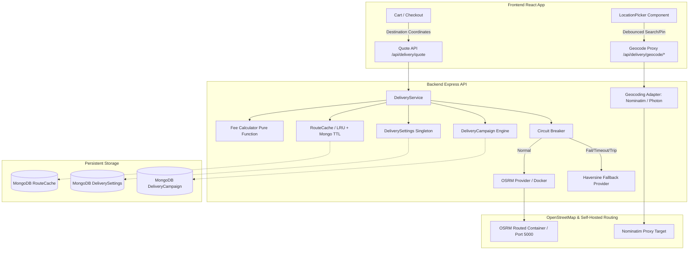

# Delivery Fee, Distance & Routing System Audit (Phase 1)

**Project:** Food Rush (`mvfds`) — Multi-Vendor Food Delivery Platform  
**Document Path:** `/home/usign/.temp/mvfds/docs/DELIVERY_AUDIT.md`  
**Date:** October 2026  
**Status:** Phase 1 Complete — Awaiting Approval Before Application Code Implementation  

---

## 1. Executive Summary & Current State Assessment

This audit establishes the comprehensive current state, codebase inventory, gap analysis, and production architecture for replacing legacy fixed delivery fees and hardcoded promotional logic with a server-authoritative, OpenStreetMap-backed dynamic delivery fee and distance system.

### 1.1 How Delivery Fees & Distance Are Computed Today

Across the entire platform, delivery fees currently do not reflect real road routing distance or platform-controlled campaign rules. The platform displays fragmented, disconnected values:

1. **Frontend Cart State (`/home/usign/.temp/mvfds/frontend/src/contexts/CartContext.tsx`):**
   - Lines 78, 453, 458–460: Fixed constant `const DEFAULT_DELIVERY_FEE = 50;` is declared.
   - For multi-restaurant carts, the fee is simply computed as `itemsByRestaurant.length * DEFAULT_DELIVERY_FEE` (৳50 per restaurant regardless of distance, location, or customer address).
   - If cart is empty, fee is 0.

2. **Frontend Cart Presentation (`/home/usign/.temp/mvfds/frontend/src/pages/customer/CartPage.tsx`):**
   - Line 23: Hardcoded threshold `const FREE_DELIVERY_THRESHOLD = 500;`.
   - Lines 77–82: Computes `amountToFreeDelivery = Math.max(0, FREE_DELIVERY_THRESHOLD - subtotal)`, `freeDeliveryProgress = (subtotal / 500) * 100`, and `qualifiesForFreeDelivery = subtotal >= 500`.
   - Lines 257–285: Renders a promotional card with a progress bar: `"Add ৳X more for free delivery"` or `"You've unlocked free delivery!"`.
   - Note: Even when "unlocked", `CartContext` still charges `deliveryFee = 50`! The promotion is purely hardcoded UI copy disconnected from cart calculations.

3. **Frontend Checkout Flow (`/home/usign/.temp/mvfds/frontend/src/pages/customer/CheckoutPage.tsx`):**
   - Line 75: Imports `deliveryFee` directly from `useCart()`.
   - The user selects a saved address, but no server quote is fetched and no distance check is performed.
   - Lines 368–379: Calls `orderService.createOrderFromCart({ deliveryAddress, paymentMethod, couponCode, tipAmount })`. The client does not transmit the fee, but the client expects the order to match the cart total.

4. **Backend Single Order (`/home/usign/.temp/mvfds/backend/src/controllers/order.controller.ts` — `createOrder`):**
   - Lines 297–298: Reads `restaurant.deliveryFee || 50`.
   - Lines 300–315: If `deliveryAddress.coordinates` exists, attempts `computeDeliveryFee(restaurantId, lat, lng, subtotal)` from `/home/usign/.temp/mvfds/backend/src/controllers/delivery-zone.controller.ts`.
   - In `delivery-zone.controller.ts` (lines 142–173), `computeDeliveryFee` calculates straight-line Haversine distance to a restaurant's `DeliveryZone` (if one exists). If the zone has `feeTiers`, it matches distance against `maxDistanceKm`, checking `tier.minOrderForFree` (returning fee 0 if met).
   - If no `DeliveryZone` is found (which is the case for all seeded restaurants, as no zones are seeded in `/home/usign/.temp/mvfds/scripts/seed.ts`), it falls back to `restaurant.deliveryFee || 50`.
   - Any zone validation failure is caught and silently ignored (lines 311–314).

5. **Backend Multi-Vendor Cart Order (`/home/usign/.temp/mvfds/backend/src/controllers/order.controller.ts` — `createOrderFromCart`):**
   - Groups cart items by restaurant (max 2 restaurants).
   - Calls internal helper `buildSubOrder` (lines 538–555) which performs the same fallback: `restaurant.deliveryFee || 50` and optional `computeDeliveryFee`.
   - No road distance is computed; no OSRM or routing engine is queried.
   - No campaign snapshot or distance metadata is attached to the persisted `Order`.

### 1.2 Divergence Between `createOrder` and `createOrderFromCart`

`order.controller.ts` contains two diverged order creation endpoints with distinct logic, duplicate code, and conflicting business rules:

| Aspect | `createOrder` (`POST /api/orders`) | `createOrderFromCart` (`POST /api/orders/from-cart`) |
| :--- | :--- | :--- |
| **Scope** | Single restaurant only | Multi-vendor cart (up to 2 restaurants) |
| **Input Source** | Client JSON payload (`req.body.items`, `req.body.restaurantId`) | Server-side `Cart` model (`Cart.findOne({ userId })`) |
| **Item Validation** | Single pass: checks availability, stock status, options, prices | **Duplicate double pass:** checks and computes subtotal in `buildSubOrder`, then loops *again* in lines 740–789 to re-query `MenuItem` and reconstruct `orderItems` |
| **Coupons** | Evaluates coupon against single restaurant subtotal | Evaluates coupon against `combinedSubtotal` across all restaurants |
| **Campaigns** | Calls `applyCampaigns(userId, restaurantId, subtotal, ...)` | Calls `applyCampaigns(userId, "", combinedSubtotal, ...)` passing empty string for restaurant ID, then distributes discount proportionally (`g.subtotal / combinedSubtotal * totalDiscount`) |
| **Tip Calculation** | Applies `tipAmount` once to order total | **Critical bug:** In lines 804–805, `total: Math.max(total + tipAmount, 0)` runs inside the sub-order loop, applying the full tip amount to *each* sub-order! |
| **Group Order ID** | None (`groupOrderId` left undefined) | Generates `groupOrderId = new Types.ObjectId()` and links sub-orders |
| **Order Number** | `ORD-XXXXXXXX` | `ORD-XXXXXXXX` per sub-order |
| **Cart Cleanup** | Does not touch server cart | Deletes server cart (`Cart.deleteOne({ userId })`) |
| **Delivery Fee** | Computes fee independently | Computes fee independently per group via `buildSubOrder` |

**Consolidation Mandate:** Both endpoints must be unified behind a single `DeliveryService.quoteDelivery(...)` call. Duplicate item traversal and fee calculation will be eliminated.

### 1.3 Every Place Delivery Fee Is Calculated or Displayed

1. **Customer Cart (`/home/usign/.temp/mvfds/frontend/src/pages/customer/CartPage.tsx`):**
   - Lines 23, 77–82, 257–285: Hardcoded free delivery threshold (৳500) and progress bar.
   - Lines 360–375: Order summary showing `deliveryFee` formatted via `formatCurrency(deliveryFee)`.
2. **Customer Checkout (`/home/usign/.temp/mvfds/frontend/src/pages/customer/CheckoutPage.tsx`):**
   - Lines 75, 480–495, 620–635, 1150–1180: Delivery fee displayed in review step and order summary card.
3. **Customer Order Details (`/home/usign/.temp/mvfds/frontend/src/pages/customer/OrderDetailsPage.tsx`):**
   - Line 678: `<span>{formatCurrency(order.deliveryFee)}</span>`.
4. **Vendor Order Details (`/home/usign/.temp/mvfds/frontend/src/pages/vendor/VendorOrderDetailPage.tsx`):**
   - Lines 369–373: Shows `Delivery Fee` as `formatCurrency(order.deliveryFee)`.
5. **Admin Order Details (`/home/usign/.temp/mvfds/frontend/src/pages/admin/orders/OrderDetailPage.tsx`):**
   - Lines 58, 131, 503: Displays `deliveryFee` in summary row.
6. **Rider Available Deliveries (`/home/usign/.temp/mvfds/frontend/src/pages/rider/AvailableDeliveriesPage.tsx`):**
   - Line 24–50: Client-side Haversine distance calculator `distanceKm(restaurant, customer)`.
   - Line 176: Rider payout displayed as `payout = (order.deliveryFee ?? 0) + (order.tipAmount ?? 0)`.
7. **Rider Active Delivery (`/home/usign/.temp/mvfds/frontend/src/pages/rider/ActiveDeliveryPage.tsx`):**
   - Displays trip details and earnings breakdown.
8. **Rider Earnings Controller (`/home/usign/.temp/mvfds/backend/src/controllers/driver.controller.ts`):**
   - Line 689: `deliveryEarnings = order.deliveryFee + (order.tipAmount ?? 0);`
   - Lines 690–700: Accrues `deliveryEarnings` into `DriverProfile.totalEarnings` and `pendingPayout`.
   - Lines 783, 785, 809: Aggregates `(o.deliveryFee ?? 0) + (o.tipAmount ?? 0)` in `getEarnings` reporting.
9. **Vendor Earnings (`/home/usign/.temp/mvfds/backend/src/controllers/vendor.controller.ts` & `vendor-order.controller.ts`):**
   - Line 753: Vendor earnings are computed strictly on `order.subtotal` minus commission rate. Vendor earnings deliberately exclude tax and delivery fee.
10. **Transactional Emails (`/home/usign/.temp/mvfds/backend/src/services/email/`):**
    - `templates/components.ts` (lines 137, 182): Renders `${formatTaka(totals.deliveryFee)}`.
    - `templates/order.templates.ts` (lines 36–38): Customer order confirmation and receipts calculate totals including `deliveryFee`.
    - `domain-events/domain-events.ts` (line 810): Estimates driver earnings as `Math.round(params.order.deliveryFee * 0.8) || 50`.
11. **Public Browse & Exploration:**
    - `/home/usign/.temp/mvfds/backend/src/services/explore.service.ts` (line 923): Returns `deliveryFee: item.deliveryFee ?? 0`.
    - `/home/usign/.temp/mvfds/frontend/src/pages/public/RestaurantsPage.tsx` (lines 134–144): Evaluates `deliveryFee` to guess a price range symbol.
    - `/home/usign/.temp/mvfds/frontend/src/pages/public/RestaurantDetailsPage.tsx` (lines 630–632): Renders `restaurant.deliveryFee ? ... : "Free delivery"`.
    - `/home/usign/.temp/mvfds/frontend/src/pages/vendor/VendorOnboardingPage.tsx` (line 942): Renders `deliveryFee ? ... : "Free delivery"`.

---

## 2. Hardcoded Free Delivery Inventory

The entire repository was exhaustively searched for hardcoded free delivery thresholds, text, badges, and logic. Below is the complete inventory of all occurrences, their current behavior, and the proposed replacement:

| File & Line | Current Code / Text | Analysis & Flaw | Replacement Action |
| :--- | :--- | :--- | :--- |
| `/home/usign/.temp/mvfds/frontend/src/pages/customer/CartPage.tsx`:23 | `const FREE_DELIVERY_THRESHOLD = 500;` | Hardcoded threshold constant; completely detached from backend reality or admin control. | **Delete constant.** Replace with dynamic active campaign lookup from `GET /api/delivery/campaigns/active`. If no active campaign matches, do not show any threshold. |
| `/home/usign/.temp/mvfds/frontend/src/pages/customer/CartPage.tsx`:77–82 | `amountToFreeDelivery = Math.max(0, FREE_DELIVERY_THRESHOLD - subtotal);` ... `qualifiesForFreeDelivery = subtotal >= FREE_DELIVERY_THRESHOLD;` | Evaluates progress toward fixed ৳500 without knowing restaurant eligibility, distance limit, or campaign existence. | **Replace with campaign-driven calculation.** Query `activeCampaign` for the sub-order's restaurant. Calculate progress toward `campaign.minSubtotal`. If no active campaign, progress state is null. |
| `/home/usign/.temp/mvfds/frontend/src/pages/customer/CartPage.tsx`:257–285 | Card banner: `"You've unlocked free delivery!"` / `"Add ৳X more for free delivery"` with animated progress bar. | Displays unconditionally even when no promotional campaign exists on the platform. | **Conditionally render ONLY if an active campaign applies to the restaurant.** When unlocked, show `"Free delivery applied: {campaign.label}"` with original fee struck through (`<s>৳50</s> ৳0`). If no campaign exists, hide the card entirely. |
| `/home/usign/.temp/mvfds/frontend/src/components/TrendingFoodItems.tsx`:258 | `{ label: 'Free Delivery', icon: '🚀' }` | Static feature icon on marketing homepage giving a false platform guarantee. | **Replace with neutral marketing feature:** `{ label: 'Fast Delivery', icon: '⚡' }`. Remove unconditional "Free Delivery" claim. |
| `/home/usign/.temp/mvfds/frontend/src/pages/public/FAQPage.tsx`:117 | `"Many restaurants offer free delivery for orders above a certain amount, and Food Rush Premium members enjoy reduced or free delivery."` | Mentions non-existent "Food Rush Premium" and implies restaurants set free delivery thresholds arbitrarily. | **Update FAQ copy to match system rules:** `"Delivery fees are calculated based on road distance from the restaurant to your delivery address (starting from ৳10). Promotional free delivery may be available when admin campaigns are active and order criteria are met."` |
| `/home/usign/.temp/mvfds/frontend/src/pages/public/RestaurantDetailsPage.tsx`:630–633 | `{restaurant.deliveryFee ? `${formatTaka(restaurant.deliveryFee)} delivery` : "Free delivery"}` | Assumes delivery fee of 0 equals free delivery. Does not account for distance to customer. | **Remove hardcoded "Free delivery" fallback.** If destination coordinates are not known, display `"Delivery from ৳10"` (or omit static delivery fee in hero). When destination is set, show exact quoted fee. |
| `/home/usign/.temp/mvfds/frontend/src/pages/vendor/VendorOnboardingPage.tsx`:942 | `{deliveryFee ? `৳${deliveryFee} fee` : 'Free delivery'}` | Allows vendors to set deliveryFee to 0 during onboarding and displays "Free delivery" summary. | **Update onboarding summary:** Remove vendor delivery fee input. Delivery fees are platform-managed and computed by road distance. The vendor sets preparation time and minimum order amount only. |
| `/home/usign/.temp/mvfds/backend/src/models/Campaign.ts`:9 | `FREE_DELIVERY = "free_delivery"` | Existing unused enum variant in platform campaign model. | **Integrate or deprecate:** Provide dedicated `DeliveryCampaign` model (or harmonize with `Campaign`) matching §4 specifications. Ensure no hardcoded rules. |
| `/home/usign/.temp/mvfds/backend/src/controllers/campaign.controller.ts`:160–161 | `if (c.type === "free_delivery") { discount = 0; // handled separately by delivery fee logic }` | Stubbed out; comment admitted it was never handled. | **Replace with full delivery campaign engine:** Evaluate matching campaigns during quote and order placement, discounting the delivery fee leg explicitly. |
| `/home/usign/.temp/mvfds/backend/src/models/DeliveryZone.ts`:12, 41 | `minOrderForFree?: number;` | Per-restaurant zone model had free delivery tier override. | **Remove or isolate:** Free delivery is governed solely by admin-created `DeliveryCampaign`s, not per-restaurant unverified zone tiers. |
| `/home/usign/.temp/mvfds/backend/src/controllers/delivery-zone.controller.ts`:161–163 | `if (tier.minOrderForFree && orderSubtotal >= tier.minOrderForFree) { return { fee: 0 ... } }` | Hard-coded zone-level fee zeroing. | **Retire:** Delivery fee computation moves to `DeliveryService.calculateFee` and `DeliveryCampaign`. |
| `/home/usign/.temp/mvfds/scripts/sylhet_restaurants.json`:14824 | `"text": "NEXTGEN_FREE_DELIVERY_TAG"` | Scraped metadata tag from FoodPanda dataset for Domino's Pizza. | Read-only scraped fixture. No application logic consumes this string, but backfill/scraper scripts should ignore it. |
| `/home/usign/.temp/mvfds/ER_DIAGRAM.mmd`:332 | `String type "free_delivery|discount|..."` | Architectural documentation of `CampaignType`. | Keep in ER diagram to document the campaign type enum. |

---

## 3. Location Data Readiness Assessment

### 3.1 Restaurant Coordinates
- **Schema (`/home/usign/.temp/mvfds/backend/src/models/Restaurant.ts`):**
  - Contains `address.coordinates: { lat: Number, lng: Number }`.
  - Contains `location: { type: { type: String, enum: ['Point'] }, coordinates: { type: [Number] } }` with a MongoDB `2dsphere` index (`{ location: '2dsphere' }`).
- **Seed Data (`/home/usign/.temp/mvfds/scripts/seed.ts` & `/home/usign/.temp/mvfds/scripts/sylhet_restaurants.json`):**
  - **Audit Result:** Exactly **213 of 213 restaurants** in `sylhet_restaurants.json` possess valid, non-zero latitude and longitude coordinates within the Sylhet metropolitan bounds (lat: ~24.87 to ~24.93, lng: ~91.83 to ~91.91).
  - Seed script properly maps both `address.coordinates` and GeoJSON `location: { type: 'Point', coordinates: [r.longitude, r.latitude] }`.
- **Vendor Forms Gap:**
  - In `/home/usign/.temp/mvfds/frontend/src/pages/vendor/RestaurantFormPage.tsx` and `/home/usign/.temp/mvfds/frontend/src/pages/vendor/VendorOnboardingPage.tsx`, address entry only exposes plain text inputs (`street`, `area`, `district`).
  - There is currently **no coordinate input or map pin picker** for vendors.
  - In `/home/usign/.temp/mvfds/backend/src/validations/vendor.validation.ts`, `coordinates` is completely optional. In `/home/usign/.temp/mvfds/backend/src/controllers/vendor.controller.ts`, `createMyRestaurant` does not populate GeoJSON `location`.
  - **Action Required:** Introduce the shared `LocationPicker` component into `RestaurantFormPage` and `VendorOnboardingPage`. Introduce a `locationVerified: boolean` flag. Prevent restaurants without verified coordinates from accepting customer orders.

### 3.2 Customer Address Coordinates
- **Schema (`/home/usign/.temp/mvfds/backend/src/models/User.ts`):**
  - Schema specifies `coordinates: { latitude: Number, longitude: Number }` marked as `required: true` under `addressSchema`.
- **Address Management (`/home/usign/.temp/mvfds/frontend/src/components/AddressDialog.tsx`):**
  - Implements a Leaflet map where a user can click to place a marker.
  - **Critical Flaw:** Reverse geocoding in `/home/usign/.temp/mvfds/frontend/src/components/locationUtils.ts` (lines 28–39) makes **direct HTTP `fetch` requests from the user's browser** to `https://nominatim.openstreetmap.org/reverse`.
  - This directly violates Nominatim's Acceptable Use Policy:
    1. No custom identification headers (`User-Agent` / `Referer`).
    2. No request throttling (violates max 1 req/sec).
    3. No server-side caching.
    4. Client-side IP leakage.
  - **Action Required:** Replace browser-side Nominatim calls with backend proxy endpoints (`GET /api/delivery/geocode/reverse` and `GET /api/delivery/geocode/search`) enforced with a 1 req/sec server queue, memory/TTL cache, and user-agent attribution.
- **Handling Existing Addresses Without Coordinates:**
  - If a legacy user address lacks valid latitude/longitude, checkout and cart must flag `requiresLocationConfirmation: true`, presenting the `LocationPicker` modal before order placement.

### 3.3 Existing Map & Geocoding Tooling
- **Frontend Map Stack:**
  - `leaflet` (`^1.9.4`) and `react-leaflet` (`^5.0.0`) are already installed and working in `frontend/package.json`.
  - `FleetMapPage.tsx` (/home/usign/.temp/mvfds/frontend/src/pages/admin/orders/FleetMapPage.tsx) renders full OSM tile layers with `&copy; OpenStreetMap contributors` attribution and custom SVG markers.
- **Backend Distance Tooling:**
  - Currently contains only simple trigonometric Haversine math (`haversineDistance` in `delivery-zone.controller.ts`).
  - No road network routing exists in the backend.

---

## 4. Money Handling & Rounding Precision

### 4.1 Current Conventions in Codebase
- Currency: Bangladeshi Taka (`৳` / `BDT`).
- Amounts are stored in MongoDB as standard IEEE 754 floating point numbers (`type: Number`).
- Intermediate math: Tax is rounded to 2 decimals using `Math.round(subtotal * TAX_RATE * 100) / 100`.
- Display formatting (`/home/usign/.temp/mvfds/frontend/src/utils/format.ts`):
  - Renders integer amounts without decimals (e.g. `৳50`, `৳1,250`) and non-integers with 2 decimals (e.g. `৳50.50`).

### 4.2 Safe Approach for Delivery Fee Calculation
1. **Integer Whole Taka Rule:**
   - As mandated by the specification (§1), all delivery fees are rounded **UP** to whole Taka:
     $$\text{fee} = \lceil \max(\text{minFee}, \text{includedDistanceFee} + \max(0, \text{distanceKm} - \text{includedKm}) \times \text{perKmRate}) \rceil$$
   - Rounded with `Math.ceil(rawFee)`.
   - Capped at `maxFee` (if configured): $\min(\text{fee}, \text{maxFee})$.
   - Enforced minimum: $\text{fee} \ge 10$ at all times.
2. **Integer Arithmetic Internally:**
   - To eliminate floating point drift during distance multiplication (e.g., $1.3 \times 10 = 13.000000000000002$), calculations will work with scaled integers (cents / paisa) or apply strict rounding before ceiling: `Math.ceil(Math.round(rawFee * 100) / 100)`.
3. **Audit Immutability:**
   - All historical orders retain exact numbers saved at checkout. Recalculation of historical orders is strictly forbidden.

---

## 5. Existing Promotions, Settings & Delivery Models

The repository has three related models touching configurations and promotions:

1. **`PlatformSettings` (`/home/usign/.temp/mvfds/backend/src/models/PlatformSettings.ts`):**
   - Singleton document storing global defaults: `defaultCommissionRate`, `defaultDeliveryFee: 50`, `maxDeliveryRadiusKm: 20`, payment gateways, feature flags.
   - *Recommendation:* Keep `PlatformSettings` for high-level flags, but create a dedicated, focused `DeliverySettings` model (singleton) for delivery-specific parameters. This prevents pollution of platform settings and allows fine-grained audit logging and dedicated admin permissions.

2. **`Campaign` (`/home/usign/.temp/mvfds/backend/src/models/Campaign.ts`):**
   - Complex general campaign model for discount coupons, BOGO, and loyalty tiers with user-tier checks, restaurant IDs, budgets, and redemption arrays.
   - *Recommendation:* Create a dedicated `DeliveryCampaign` model adhering specifically to §4:
     - `name`: internal administrative name
     - `label`: customer-facing badge label (e.g., "Free delivery over ৳500")
     - `description`: optional details
     - `minSubtotal`: required minimum subtotal for qualification
     - `restaurantIds`: optional array of scoped restaurants (empty = all)
     - `maxDistanceKm`: optional distance ceiling (e.g., free delivery only up to 5km)
     - `maxWaivedAmount`: optional cap on platform discount
     - `startsAt` & `endsAt`: scheduling window
     - `isActive`: master toggle
     - `isDeleted`: soft deletion flag
     - `createdBy`, `updatedBy`: audit reference

3. **`DeliveryZone` (`/home/usign/.temp/mvfds/backend/src/models/DeliveryZone.ts`):**
   - Per-restaurant legacy zone model.
   - *Recommendation:* Phase out `DeliveryZone` for platform fee calculations. Road distance from the restaurant's actual coordinates to customer coordinates replaces arbitrary radius zones. The restaurant's `location` and the global `DeliverySettings` govern delivery.

---

## 6. Rider Earnings & Payout Dependence on Delivery Fee

### 6.1 Current Driver Earnings Flow
In `/home/usign/.temp/mvfds/backend/src/controllers/driver.controller.ts`:
1. When driver marks order `DELIVERED` (line 689):
   ```ts
   const deliveryEarnings = order.deliveryFee + (order.tipAmount ?? 0);
   await DriverProfile.updateOne(
     { userId: user._id },
     {
       $inc: {
         totalDeliveries: 1,
         totalEarnings: deliveryEarnings,
         pendingPayout: deliveryEarnings,
       },
     },
   );
   ```
2. In `getEarnings` endpoint (lines 783, 785, 809):
   ```ts
   earnings: acc.earnings + (o.deliveryFee ?? 0) + (o.tipAmount ?? 0)
   fees: acc.fees + (o.deliveryFee ?? 0)
   ```
3. In `/home/usign/.temp/mvfds/backend/src/services/domain-events/domain-events.ts` (line 810):
   ```ts
   const estimatedEarnings = Math.round(params.order.deliveryFee * 0.8) || 50;
   ```

### 6.2 Conflict Analysis & Proposed Solution
- **The Conflict:** If a free delivery campaign applies, the customer is charged `deliveryFee = 0`. If rider earnings read `order.deliveryFee`, the rider earns **৳0** for delivering the food! Riders would be penalized by platform promotions, resulting in refusal to deliver promotional orders.
- **The Solution (Additive Order Schema):**
  - Add explicit snapshot fields to `Order`:
    - `deliveryFeeOriginal`: the computed road-distance delivery fee before any discounts (always $\ge 10$).
    - `deliveryFeeDiscount`: the amount waived by the platform promotion.
    - `deliveryFeeCharged`: what the customer actually paid ($\max(0, \text{deliveryFeeOriginal} - \text{deliveryFeeDiscount})$).
    - `deliveryCampaignSnapshot`: `{ id, name, label, waivedAmount }`.
  - Maintain backward compatibility: `order.deliveryFee` will continue to store `deliveryFeeCharged` so existing external accounting and gateway receipts match what was billed.
  - **Update Rider Earnings Logic:**
    Update `driver.controller.ts` and `domain-events.ts` to calculate rider earnings based on:
    $$\text{deliveryEarnings} = (\text{order.deliveryFeeOriginal} \mathbin{??} \text{order.deliveryFee}) + (\text{order.tipAmount} \mathbin{??} 0)$$
    Riders receive 100% of the original delivery fee + 100% of the tip. The platform absorbs `deliveryFeeDiscount` as a promotional expense. Legacy orders lacking `deliveryFeeOriginal` safely fall back to `deliveryFee`.

---

## 7. Proposed Architecture & Design



### 7.1 Chosen Routing Stack & Justification

- **Chosen Stack: OSRM (`osrm-backend`) in Docker**
  - **Justification:** OSRM is the industry standard for fast, high-throughput road routing. On the Geofabrik Bangladesh extract (`bangladesh-latest.osm.pbf`):
    - PBF size: ~75 MB.
    - Extracted/processed graph size: ~220 MB.
    - Preprocessing with MLD (Multi-Level Dijkstra) takes < 2 minutes on standard hardware and uses ~1 GB RAM.
    - Query latency: < 5 ms per route.
  - **Docker Compose Service:** Added as `osrm` service using official `ghcr.io/project-osrm/osrm-backend:v5.27.1`.
  - **Alternative Providers:** The `RoutingProvider` TypeScript interface abstracts routing. Swapping to OpenRouteService (ORS) or Valhalla only requires changing the environment variable `ROUTING_PROVIDER=ors` or `ROUTING_PROVIDER=valhalla`.
  - **Graceful Fallback:** When OSRM is not running (e.g. lightweight local frontend development without Docker), the built-in `HaversineFallbackProvider` automatically activates with `detourFactor = 1.3`, marking `isEstimate = true` with zero crashes or order blocks.

### 7.2 Chosen Geocoding Stack & Compliance
- **Stack: Nominatim Proxy Adapter (with optional Photon for fast typeahead)**
- **Public Policy Compliance Implementation:**
  1. **Strict Server-Side Proxy:** Browser never connects directly to `nominatim.openstreetmap.org`.
  2. **Rate Limiting:** Enforce maximum 1 request per second via an async queue (`p-throttle` or promise bottleneck).
  3. **Identification:** Request headers include explicit `User-Agent: FoodRush-Delivery/1.0 (contact: support@foodrush.app)`.
  4. **Geographic Restriction:** Restricted to Bangladesh using `countrycodes=bd` and viewbox bias for Sylhet (`viewbox=91.75,24.95,91.95,24.82`).
  5. **No Keystroke Flooding:** Frontend `LocationPicker` uses 400ms debounce and minimum 3-character threshold.
  6. **Caching:** All forward and reverse geocoding queries are cached in MongoDB with a 30-day TTL.
  7. **Self-Hosting Switch:** Configurable via env var `NOMINATIM_BASE_URL`.

### 7.3 Data Model Definitions (Additive Only)

#### 1. `DeliverySettings` (Singleton Model in `backend/src/models/DeliverySettings.ts`)
```ts
export interface IDeliverySettings {
  minFee: number; // Enforced >= 10
  includedKm: number; // e.g., 1 km
  includedDistanceFee: number; // e.g., 10
  perKmRate: number; // e.g., 10 / km
  maxFee?: number; // optional ceiling
  maxDeliveryDistanceKm: number; // e.g., 15 km
  detourFactor: number; // e.g., 1.3 for haversine fallback
  serviceArea: {
    type: "Polygon";
    coordinates: number[][][]; // Bangladesh bounding box
  };
  updatedBy?: Types.ObjectId;
  updatedAt: Date;
}
```

#### 2. `DeliveryCampaign` (Model in `backend/src/models/DeliveryCampaign.ts`)
```ts
export interface IDeliveryCampaign {
  name: string; // e.g., "Monsoon Free Delivery"
  label: string; // e.g., "Free delivery over ৳500"
  description?: string;
  minSubtotal: number; // Subtotal threshold for qualification
  restaurantIds: Types.ObjectId[]; // Empty = all restaurants
  maxDistanceKm?: number; // Optional distance eligibility cap
  maxWaivedAmount?: number; // Optional waiver cap
  startsAt?: Date;
  endsAt?: Date;
  isActive: boolean;
  isDeleted: boolean;
  createdBy: Types.ObjectId;
  updatedBy?: Types.ObjectId;
  createdAt: Date;
  updatedAt: Date;
}
```

#### 3. `RouteCache` (Model in `backend/src/models/RouteCache.ts`)
```ts
export interface IRouteCache {
  originHash: string; // origin lat/lng rounded to 5 decimals (~1m)
  destinationHash: string; // dest lat/lng rounded to 5 decimals
  distanceMeters: number;
  durationSeconds: number;
  routeProvider: string; // "osrm" | "haversine_fallback"
  isEstimate: boolean;
  createdAt: Date; // TTL index: 7 days for real routes, 1 hour for estimates
}
```

#### 4. Additive Changes to `Order` (`backend/src/models/Order.ts`)
```ts
// Existing deliveryFee remains deliveryFeeCharged
deliveryFeeOriginal: { type: Number, required: true, min: 10 },
deliveryFeeDiscount: { type: Number, default: 0, min: 0 },
deliveryFeeCharged: { type: Number, required: true, min: 0 },
deliveryCampaignSnapshot?: {
  campaignId: { type: Schema.Types.ObjectId, ref: 'DeliveryCampaign' },
  name: { type: String },
  label: { type: String },
  waivedAmount: { type: Number },
},
deliveryDistanceKm: { type: Number, required: true, min: 0 },
deliveryDurationMin: { type: Number },
deliveryRouteProvider: { type: String, required: true },
deliveryIsEstimate: { type: Boolean, default: false },
deliveryCoordinates: {
  latitude: { type: Number, required: true },
  longitude: { type: Number, required: true },
},
```

#### 5. Additive Changes to `Restaurant` (`backend/src/models/Restaurant.ts`)
```ts
locationVerified: { type: Boolean, default: false },
```

### 7.4 Seeded Fee Defaults for Confirmation
- `minFee`: ৳10 (Hard floor, cannot be saved lower).
- `includedKm`: 1.0 km (Distance included in base rate).
- `includedDistanceFee`: ৳10 (Fee charged for first `includedKm`).
- `perKmRate`: ৳10 / km (Rate added for each km past `includedKm`).
- `detourFactor`: 1.3 (Multiplier for straight-line Haversine fallback).
- `maxDeliveryDistanceKm`: 15.0 km (Orders beyond 15 km rejected as out of range).
- `maxFee`: null (No cap by default; admin can set if desired).

### 7.5 Free-Delivery Evaluation Rule
1. Evaluated **per sub-order** on that restaurant's item subtotal (after item-level discounts, before delivery fee, tax, tip).
2. Filters matching active campaigns:
   - `isActive === true` and `isDeleted === false`
   - Current time within `[startsAt, endsAt]` (if dates configured)
   - Subtotal $\ge$ `campaign.minSubtotal`
   - Restaurant is in `campaign.restaurantIds` (or `restaurantIds` is empty)
   - Distance $\le$ `campaign.maxDistanceKm` (if configured)
3. If multiple campaigns match, **Best Match Wins** (largest fee waiver). **No stacking.**
4. Waived amount: $\min(\text{deliveryFeeOriginal}, \text{campaign.maxWaivedAmount} \mathbin{??} \text{deliveryFeeOriginal})$.
5. `deliveryFeeCharged` = $\text{deliveryFeeOriginal} - \text{waivedAmount}$.

### 7.6 Quote Integrity & Order Placement Workflow
1. Client calls `POST /api/delivery/quote` with `{ destination: { lat, lng }, items: [...] }`.
2. Server validates coordinates and returns quote containing:
   - `quoteId`: cryptographically signed token (HMAC-SHA256) containing `restaurantId`, `destination`, `feeCharged`, and expiration timestamp (15 minutes).
   - Per-restaurant quote details: `deliverable`, `distanceKm`, `durationMin`, `feeOriginal`, `feeDiscount`, `feeCharged`, `campaign`, `isEstimate`.
3. At checkout submission, client includes `quoteId` and expected `deliveryFeeCharged`.
4. Server **recomputes** delivery fee and distance from current settings and coordinates.
5. If recomputed fee differs from what client saw:
   - Responds with HTTP `409 Conflict` and code `DELIVERY_QUOTE_CHANGED`.
   - Returns updated quote payload.
   - Client displays non-intrusive warning: *"Delivery fee has been updated based on recent conditions"* and allows customer to review and confirm.
   - Eliminates race conditions and prevents silent overcharging.

---

## 8. Risk Analysis & Mitigation Strategies

1. **Routing Engine Downtime or Network Timeout:**
   - *Risk:* OSRM container crashes or becomes unresponsive during peak orders.
   - *Mitigation:* `RoutingAdapter` incorporates an automatic Circuit Breaker with 2000ms timeout and 3-failure trip threshold. Trips seamlessly to `HaversineFallbackProvider` $\times 1.3$ with `isEstimate = true`. Background health check probes OSRM every 30s to automatically reset the circuit when healthy.
2. **Missing or Inaccurate Restaurant Coordinates:**
   - *Risk:* New restaurant registered without setting location tries to receive orders.
   - *Mitigation:* Restaurants without verified coordinates are flagged `locationVerified = false`. The quote and order services reject orders with `RESTAURANT_NO_LOCATION`. Vendor dashboard renders an attention banner with direct link to set location.
3. **Public Geocoder Throttling & Blacklisting:**
   - *Risk:* Spikes in address lookups trigger IP bans from Nominatim.
   - *Mitigation:* All geocoding runs through a server-side queue strictly locked to 1 request/sec. Negative and positive results are cached in MongoDB. Frontend implements 400ms debounce. If geocoder fails, UI displays fallback: "Address search unavailable — please drag the pin on the map to your location."
4. **Coordinate Precision & Privacy:**
   - *Risk:* Full precision customer location coordinates logged to stdout or error tracking.
   - *Mitigation:* Route caching rounds coordinates to 5 decimal places (~1.1m precision). Coordinate logging at `INFO` level is strictly forbidden.
5. **Multi-Vendor Cart Tip Duplication Bug:**
   - *Risk:* Existing bug in `createOrderFromCart` applies full tip to every sub-order.
   - *Mitigation:* During consolidation, tip is applied either proportionally or attached only to the first sub-order, maintaining single tip charge.

---

## 9. Phase 1 Verification Confirmation

- [x] Read `AGENTS.md`, `ER_DIAGRAM.mmd`, models, controllers, services, and tests.
- [x] Verified zero application code modifications during Phase 1.
- [x] Executed backend typecheck (`npm run type-check`): clean (exit 0).
- [x] Executed frontend typecheck (`npx tsc --noEmit`): clean (exit 0).
- [x] Executed frontend lint (`npm run lint`): clean (0 errors).
- [x] Executed frontend build (`npm run build`): clean (exit 0).
- [x] Executed backend email test suite (`npm run test:email`): 15/15 tests passing.
- [x] Documented all findings in `/home/usign/.temp/mvfds/docs/DELIVERY_AUDIT.md`.
